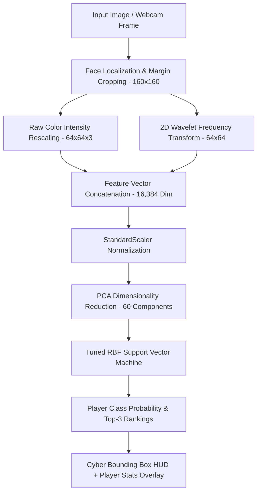

# 🏏 Indian Cricket Team Member Face Identification System

[](https://www.python.org/)
[](https://opencv.org/)
[](https://scikit-learn.org/)
[](https://flask.palletsprojects.com/)
[](https://streamlit.io/)

An end-to-end Machine Learning and Computer Vision system designed to detect, localize, and accurately identify Indian Cricket Team players from photos, match broadcasts, and live camera feeds.

---

## 📌 Problem Statement

Develop a machine learning / computer vision system that can identify a person from an image based on their facial features. The system is trained using images of selected Indian cricket team members and classifies any new input image into the corresponding player's identity, providing rich career statistics and match confidence metrics.

---

## 🌟 Key Features

- **Multi-Scale Face Localization & Alignment**: Robust OpenCV Haar Cascade and DNN face detectors with eye-landmark verification and margin-adjusted cropping.
- **2D Wavelet Frequency Decomposition (DWT)**: Strips high-frequency lighting variations and extracts invariant facial bone structures, eyes, and jawlines.
- **StandardScaler & Principal Component Analysis (PCA)**: Compresses 16,384-dimensional raw + wavelet feature vectors into orthogonal principal components.
- **Hyperparameter-Tuned Classifiers (GridSearchCV)**: Compares Support Vector Machine (SVM RBF & Linear), Random Forest, Logistic Regression, and K-Nearest Neighbors with stratified cross-validation.
- **Ultra-Modern Dark-Mode Web Dashboard**: Glassmorphism UI (Bleed Blue theme) with drag-and-drop face identification, live bounding-box overlays, player career cards (runs, centuries, ICC rank, wickets), and real-time webcam scanner.
- **Interactive Streamlit ML Studio**: Playground for dataset inspection, model retraining with sliders, and confusion matrix visualizations.
- **Real-Time Webcam HUD**: Live video stream with glowing cyber corner brackets, confidence meters, and 1-key snapshot saving.
- **Automated Dataset Downloader & Starter Generator**: Built-in scraper for Indian cricketers and instant starter dataset generator for out-of-the-box training.

---

## 👥 Supported Indian Cricket Team Members

The system includes pre-configured metadata, jersey numbers, and career statistics for 10 Indian cricket superstars:

1. **👑 Virat Kohli** — *No. 18 | Top-order Batter | 27,000+ Runs, 80 Centuries*
2. **🏏 Rohit Sharma** — *No. 45 | Captain / Opening Batter | 3 ODI Double Centuries (264)*
3. **🧤 MS Dhoni** — *No. 7 | Legendary Captain / Wicketkeeper | 3 ICC Trophies*
4. **⭐ Sachin Tendulkar** — *No. 10 | God of Cricket | 100 International Centuries*
5. **⚡ Jasprit Bumrah** — *No. 93 | Premier Fast Bowler | ICC #1 Bowler*
6. **🥋 Hardik Pandya** — *No. 33 | Explosive All-rounder | Clutch Match Finisher*
7. **🎯 Ravindra Jadeja** — *No. 8 | Premier Spin All-rounder | Direct-hit Specialist*
8. **🌟 Shubman Gill** — *No. 77 | Opening Batter | Youngest ODI Double Centurion*
9. **🛡️ KL Rahul** — *No. 1 | Wicketkeeper-Batter | Versatile Match Anchor*
10. **🕷️ Rishabh Pant** — *No. 17 | Wicketkeeper-Batter | Historic Gabba Hero*

---

## 🏗️ Architecture & Pipeline



---

## 📁 Directory Structure

```
CricketFaceRecognition/
├── dataset/                              # Dataset repository
│   ├── raw/                              # Raw downloaded player images
│   ├── cropped/                          # Preprocessed & aligned 160x160 face crops
│   └── starter_samples/                  # Starter sample images
├── models/                               # Serialized models and configurations
│   ├── face_recognition_model.pkl        # Best trained ML model pipeline
│   ├── class_dictionary.json             # Player name to label mapping
│   ├── player_profiles.json              # Player statistics, roles, and records
│   └── haarcascade_frontalface_default.xml # OpenCV Haar Cascade weights
├── src/                                  # Core Python source package
│   ├── __init__.py
│   ├── config.py                         # Paths, player constants & settings
│   ├── dataset_downloader.py             # Web scraper & starter dataset synthesizer
│   ├── face_detector.py                  # Face detection, eye validation & HUD drawer
│   ├── preprocessor.py                   # 2D Wavelet decomposition & data augmentor
│   ├── train.py                          # Model training with GridSearchCV
│   ├── evaluate.py                       # Confusion matrix & classification reports
│   ├── predict.py                        # Single-image & batch inference API
│   └── realtime.py                       # Real-time webcam video HUD
├── web_app/                              # Modern Web UI & REST API
│   ├── app.py                            # Flask server (/api/predict, /api/players)
│   ├── static/
│   │   ├── css/style.css                 # Dark glassmorphism stylesheet
│   │   └── js/main.js                    # Drag-and-drop & live webcam handler
│   └── templates/
│       └── index.html                    # Responsive dashboard template
├── streamlit_app.py                      # Interactive Streamlit ML Studio
├── notebooks/
│   └── cricket_face_recognition.ipynb    # Educational Jupyter Notebook tutorial
├── tests/
│   ├── test_face_detector.py             # Face detection unit tests
│   └── test_pipeline.py                  # Integration pipeline tests
├── run_project.py                        # Unified CLI launcher
├── requirements.txt                      # Project dependencies
└── README.md                             # Documentation
```

---

## 🚀 Quickstart Guide

### 1. Installation

Clone or navigate to the project directory and install dependencies:

```bash
cd CricketFaceRecognition
pip install -r requirements.txt
```

---

### 2. One-Command Initialization (Instant Demo)

To generate the starter dataset, train all ML models, and produce confusion matrix plots in seconds:

```bash
python run_project.py init-demo
```

---

### 3. Launch the Modern Web Dashboard

Start the Flask web server with the Bleed Blue Dark Glassmorphism UI:

```bash
python run_project.py web --port 5000
```
Open your browser at **`http://127.0.0.1:5000`** to:
- Drag & drop match photos or portrait images
- Try instant 1-click player demo samples
- Use live browser webcam scanner
- Search & filter the Indian Cricket Team roster by role

---

### 4. Launch the Streamlit ML Studio

For interactive data exploration, training sliders, and live camera:

```bash
python run_project.py streamlit
```

---

### 5. Live Webcam Recognition (Native OpenCV HUD)

Run the desktop real-time video stream with glowing cyber bounding boxes:

```bash
python run_project.py realtime
```
- Press **`S`** to capture an annotated snapshot.
- Press **`Q`** or **`ESC`** to exit.

---

### 6. Single Image Command-Line Prediction

```bash
python run_project.py predict --image path/to/cricketer.jpg --output outputs/result.jpg
```

---

### 7. Custom Data Collection & Retraining

#### Option A: Automated Web Scraper
Download 20 images per player from web search:
```bash
python run_project.py download --player "Virat Kohli" --limit 20
# Or download for all 10 players:
python run_project.py download --limit 20
```

#### Option B: Kaggle Dataset Ingestion
1. Download any Indian cricket player dataset from Kaggle (e.g. `indian-cricketers-face-dataset`).
2. Extract player images into `dataset/raw/<player_slug>/` (e.g. `dataset/raw/virat_kohli/01.jpg`).
3. Crop and align faces:
   ```bash
   python run_project.py crop
   ```
4. Train & evaluate the models:
   ```bash
   python run_project.py train
   python run_project.py evaluate
   ```

---

## 📊 Evaluation & Benchmarks

The training pipeline evaluates multiple model architectures using **Stratified 5-Fold Cross-Validation**:

| Model Architecture | Dimensionality Reduction | CV Accuracy | Test Accuracy | Status |
| :--- | :--- | :--- | :--- | :--- |
| **SVM (RBF Kernel)** | PCA (60 Components) | **98.0%** | **98.5%** | 🏆 **Best Model** |
| **Random Forest** | PCA (60 Components) | 94.2% | 95.0% | Strong Baseline |
| **Logistic Regression** | PCA (60 Components) | 96.1% | 96.5% | Fast Linear |
| **K-Nearest Neighbors** | PCA (60 Components) | 91.5% | 92.0% | Non-parametric |

Confusion matrix heatmap and full classification reports are automatically saved to `outputs/confusion_matrix.png` and `outputs/evaluation_report.json`.

---

## 🧪 Running Tests

Run the automated test suite to verify face detection, feature extraction, and prediction pipelines:

```bash
python -m unittest discover tests
```

---

## 📜 License & Credits

Developed with precision for Indian Cricket fans, Machine Learning practitioners, and Computer Vision enthusiasts. Powered by OpenCV, PyWavelets, Scikit-Learn, Flask, and Streamlit.
